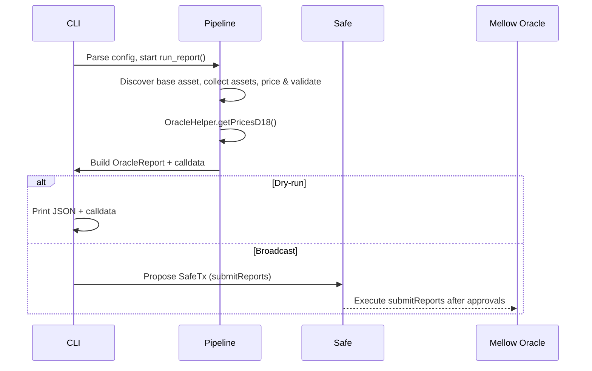
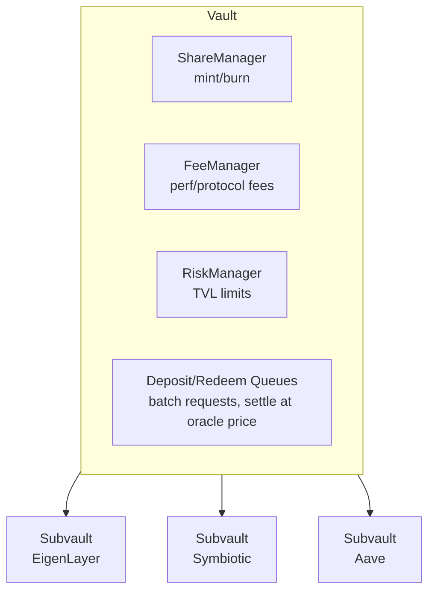
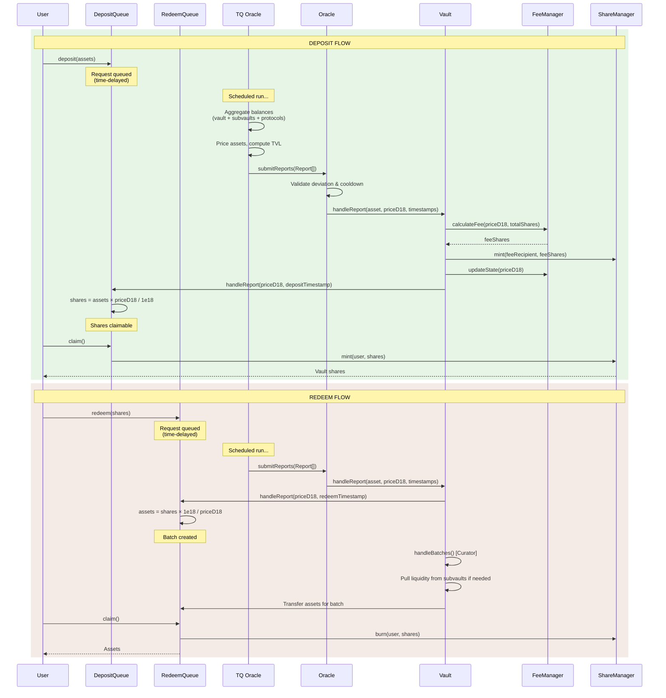

# TQ Oracle Architecture

## Overview

TQ Oracle is a Typer-based CLI that orchestrates an off-chain pipeline for producing Total Value Locked (TVL) and price reports for Mellow flexible vaults. The tool queries vault + subvault contracts, aggregates idle balances via adapters, prices assets against on-chain/off-chain sources, calls the on-chain OracleHelper to finalize prices, and then either prints a dry-run artifact or proposes a Safe transaction containing `submitReports()` calldata.

## Execution Flow

## Core Components

### CLI & Configuration (`src/tq_oracle/main.py`, `settings.py`)

- Typer command parses CLI flags, applies overrides, and instantiates `OracleSettings`.
- `OracleSettings` is the single truth for configuration: CLI args > environment/`.env` > TOML (`tq-oracle.toml` or `$HOME/.config/tq-oracle/config.toml`). Secrets are rejected from TOML and wrapped in `SecretStr`.
- Network defaults come from `constants.py` (RPC URLs, OracleHelper contracts, and canonical asset maps for Mainnet, Sepolia, Base). Missing RPC/OracleHelper values are filled automatically; block numbers are resolved via Web3 when absent.
- The CLI enforces required params (vault address, RPC, Safe creds when `--no-dry-run`) and exposes `--show-config` for redacted inspection before dispatching to `pipeline.run_report()`.

### Pipeline Orchestration (`pipeline/run.py`)

`run_report()` builds a `PipelineContext` and executes the pipeline sequentially:
1. **Base asset discovery** – `_discover_base_asset()` walks Vault → FeeManager contracts on the target chain to retrieve the canonical base asset used for pricing.
2. **Preflight** – `pipeline/preflight.py` runs adapters with backoff/retry to ensure it is safe to proceed.
3. **Asset collection** – discovers subvaults and runs asset adapters concurrently.
4. **Pricing & validation** – prices every aggregated asset, validates against Pyth, and derives final prices via OracleHelper.
5. **Report + publish** – packages results and either prints or submits to a Safe.

### Preflight Checks (`checks/pre_checks.py`, `adapters/check_adapters/*`)

- **Active proposal check**: blocks if a duplicate or pending oracle report already exists on the Safe (`active_submit_report_proposal_check.py`); can be bypassed via `--ignore-active-proposal-check`.
- **Timeout enforcement**: queries the Oracle contract for last report timestamps and security params; can be bypassed via `--ignore-timeout-check` (`timeout_check.py`).
- Each adapter returns a `CheckResult`, and `run_preflight()` retries failures up to `pre_check_retries` using `backoff` unless the adapter signals `retry_recommended=False`.

### Asset Collection (`pipeline/assets.py`, `adapters/asset_adapters/*`)

- Fetches subvault addresses via Vault ABI calls, validates `subvault_adapters` config entries, and optionally allows synthetic addresses when `skip_subvault_existence_check` is set.
- Three default adapters run automatically based on configuration:
  - `IdleBalancesAdapter` – gathers on-chain token balances across vault and all subvaults (skippable per-subvault via `skip_idle_balances`).
  - `StrETHAdapter` – fetches strETH positions (skippable via `skip_streth`).
  - `StakeWiseAdapter` – fetches StakeWise vault positions when `stakewise_vault_addresses` is configured.
- Additional adapters can be configured per subvault via `additional_adapters`; each adapter inherits from `BaseAssetAdapter` and is registered in `ADAPTER_REGISTRY`.
- Results are combined asynchronously and folded into `AggregatedAssets` via `processors/asset_aggregator.py`.

### Pricing & Validation (`pipeline/pricing.py`, `adapters/price_adapters/*`, `adapters/price_validators/pyth.py`)

- Price adapters are instantiated from `PRICE_ADAPTERS`:
  - `CowSwapAdapter` – fetches prices from CoW Protocol for general assets.
  - `ETHAdapter` – handles ETH/WETH pricing.
- Each adapter updates a shared `PriceData` accumulator keyed by asset address (base asset must already be known).
- `run_price_validations()` invokes validators from `PRICE_VALIDATORS`. The active `PythValidator` re-fetches prices through the Pyth Hermes API and compares deviations against configurable warning/failure tolerances (`price_warning_tolerance_percentage`, `price_failure_tolerance_percentage`).
- `processors/total_assets.calculate_total_assets()` multiplies balances by prices (18-decimal math) and raises if any asset lacks a quote.
- `processors/oracle_helper.derive_final_prices()` submits the total asset figure plus encoded prices to the OracleHelper contract to obtain finalized per-asset values (respecting `ignore_empty_vault`).

### Reporting & Publishing (`report/*`)

- `report/generator.py` converts context data into an `OracleReport` dataclass.
- `report/encoder.py` encodes `submitReports(Report[] reports)` calldata sorted by address and forces the base asset price to zero, mirroring the Solidity helper expectations.
- `report/publisher.py`:
  - **Dry run**: prints JSON containing the report and calldata.
  - **Broadcast**: builds a Safe transaction (`build_transaction`), signs it locally with `safe-eth-py`, posts to the Safe Transaction Service, and surfaces a Safe UI approval URL. Requires `safe_address`, `private_key`, and optional Tx Service API key.

## Configuration Highlights

Key `OracleSettings` fields:
- `vault_address`, `vault_rpc`, `network`, `block_number`.
- `oracle_helper_address` (default per network) and derived `oracle_address` (pulled from the vault contract).
- Safe submission toggles: `dry_run`, `safe_address`, `private_key`, `safe_txn_srvc_api_key`.
- Adapter behavior: `subvault_adapters`, `max_calls`, `rpc_max_concurrent_calls`, `rpc_delay/jitter`, `ignore_*` flags (empty vault, timeout, active proposal).
- Pricing knobs: `pyth_*` settings plus warning/failure tolerances.

### Subvault Adapter Configuration

Each entry under `subvault_adapters` may specify:
- `subvault_address`: Target contract (checksummed matching Vault discovery unless `skip_subvault_existence_check` is true).
- `skip_idle_balances`: Exclude default idle balance scan for that address.
- `additional_adapters`: Extra adapter names to run (must exist in `ADAPTER_REGISTRY`).

## Integration Flow with Mellow Vaults

### How Mellow Vaults Work

Mellow flexible vaults are modular yield-bearing vaults where user deposits flow through a layered architecture:

**Deposit-to-share lifecycle:**

**Key components:**

- **Vault**: Central coordinator that holds idle assets and delegates to subvaults.
- **Subvaults**: Isolated contracts deploying assets to external protocols (EigenLayer, Symbiotic, etc.).
- **ShareManager**: Controls share minting/burning with whitelist/blacklist permissions.
- **FeeManager**: Calculates performance fees (on gains) and protocol fees (time-accrued).
- **Queues**: Batch user deposit/redeem requests; settled atomically when oracle reports arrive.
- **Oracle**: Validates price reports against deviation thresholds and enforces cooldown periods.

**The oracle report lifecycle:**

1. Users submit deposit/redeem requests to queues (time-delayed).
2. TQ Oracle computes TVL by aggregating vault + subvault + external protocol balances.
3. TQ Oracle submits `Report[]` via `Oracle.submitReports()` through a Safe multisig.
4. Oracle contract validates price deviation and cooldown, then calls `Vault.handleReport()`.
5. Vault mints fee shares, updates FeeManager state, and propagates price to queues.
6. Queues convert pending deposits→shares and pending redemptions→assets at the reported price.
7. Users claim their shares or redeemed assets.

TQ Oracle is the off-chain price authority—it computes what the on-chain Oracle consumes. The on-chain Oracle enforces security invariants (max deviation, timeouts, suspicious-report flagging), but relies on TQ Oracle for accurate TVL calculation across all asset positions.

## Extension Points
- **Asset adapters**: Implement `BaseAssetAdapter`, register in `ADAPTER_REGISTRY`, and wire via `subvault_adapters`.
- **Price adapters**: Implement `BasePriceAdapter` and append to `PRICE_ADAPTERS` to join the pricing chain.
- **Price validators**: Implement `BasePriceValidator`, register in `PRICE_VALIDATORS`, and consume the shared `PriceData` accumulator.
- **Preflight checks**: Implement `BaseCheckAdapter` and add to `CHECK_ADAPTERS` for additional safety gates.

These hooks share the same settings object, so adapters can inspect CLI/env/TOML flags without bespoke wiring.
