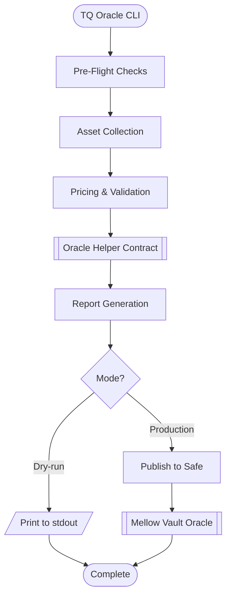
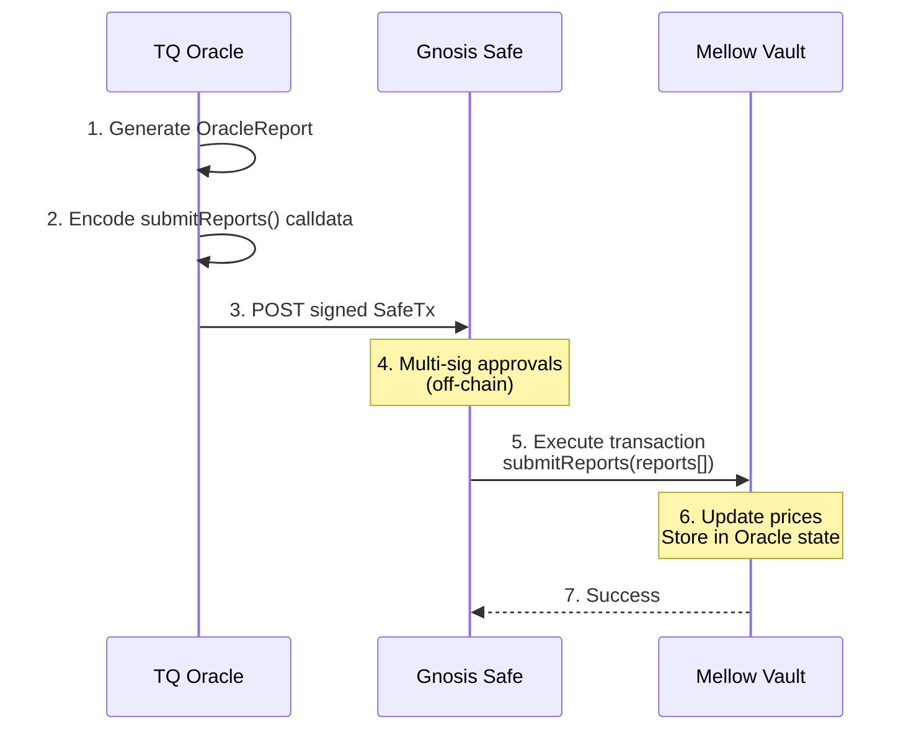

# TQ Oracle Architecture

## Overview

TQ Oracle is a Python-based off-chain oracle system that collects Total Value Locked (TVL) data from vault protocols and submits price reports to the Mellow Finance flexible-vaults ecosystem. It acts as a trusted data feed that enables accurate TVL tracking for vaults that hold assets across multiple chains and protocols.

## System Architecture

## Core Components

### 1. Entry Point (`main.py`)

The CLI entry point uses Typer for command-line interface management. It:
- Loads configuration from TOML files, environment variables, or CLI arguments
- Initializes the application state (`AppState`)
- Delegates to the `report` command for TVL reporting

**Key Configuration:**

- Network selection (mainnet, sepolia, base)
- RPC endpoints (L1 and Hyperliquid)
- Oracle and OracleHelper contract addresses
- Safe multi-sig configuration
- Dry-run vs production mode

### 2. Pipeline Orchestration (`pipeline/`)

The pipeline is the core orchestrator that sequences all oracle operations:

**Pipeline Steps** (`pipeline/run.py:run_report`):

1. **Preflight checks** - Validates system state before processing
2. **Asset collection** - Gathers holdings from all subvaults
3. **Pricing & validation** - Fetches and validates asset prices
4. **Report generation** - Creates the oracle report
5. **Submission** - Publishes to Safe or stdout

#### 2.1 Preflight Checks (`pipeline/preflight.py`)

Runs validation checks before processing TVL data to prevent race conditions and ensure data integrity:

- **Safe State Check** (`check_adapters/safe_state.py`): TODO: Ensures no duplicate or pending reports
- **CCTP Bridge Check** (`check_adapters/cctp_bridge.py`): Detects in-flight USDC transfers between L1 and Hyperliquid
- **Timeout Check** (`check_adapters/timeout_check.py`): Verifies sufficient time has passed since last report
- **Active Proposal Check** (`check_adapters/active_submit_report_proposal_check.py`): Checks for existing pending proposals

These checks implement automatic retry logic with exponential backoff when recommended.

#### 2.2 Asset Collection (`pipeline/assets.py`)

Discovers and aggregates asset holdings from multiple sources:

1. **Subvault Discovery**: Queries the Vault contract to get all subvault addresses
2. **Adapter Selection**: Determines which asset adapters to run for each subvault
3. **Parallel Fetching**: Runs all adapters concurrently using `asyncio.gather`
4. **Aggregation**: Combines results into `AggregatedAssets`

**Supported Adapters** (`adapters/asset_adapters/`):

- `IdleBalancesAdapter`: Checks for assets sat dormant in subvault
- `HyperliquidAdapter`: Fetches portfolio value from Hyperliquid DEX

#### 2.3 Pricing & Validation (`pipeline/pricing.py`)

Multi-stage pricing system with validation:

1. **Price Fetching**: Queries multiple price sources sequentially
   - `CowSwapAdapter`: Primary DEX aggregator price source
   - `ETHAdapter`: Specialized adapter for ETH-family assets (ETH, WETH)
   - `ChainlinkAdapter`: Not used in main pipeline, only for validation

2. **Price Validation** (`checks/price_validators.py`):
   - Cross-checks prices against Chainlink oracles
   - Warns if deviation exceeds `chainlink_price_warning_tolerance_percentage` (default 0.5%)
   - Fails if deviation exceeds `chainlink_price_failure_tolerance_percentage` (default 1.0%)

3. **Total Assets Calculation** (`processors/total_assets.py`):
   - Multiplies asset amounts by prices
   - Sums to get total vault TVL in base asset (ETH)

4. **Final Price Derivation** (`processors/oracle_helper.py`):
   - Calls `OracleHelper.getPricesD18()` on-chain
   - Normalizes all prices to 18 decimals
   - Applies vault-specific price logic

### 3. Data Processors (`processors/`)

Utilities for data transformation and smart contract interaction:

- **`asset_aggregator.py`**: Merges asset data from multiple adapters
- **`total_assets.py`**: Calculates TVL in base asset
- **`oracle_helper.py`**: Interfaces with the OracleHelper contract to derive final prices

### 4. Report Generation & Publishing (`report/`)

#### 4.1 Report Generator (`report/generator.py`)

Creates an `OracleReport` dataclass containing:

- `vault_address`: The target vault contract
- `total_assets`: Aggregated asset amounts by address
- `final_prices`: Normalized prices in 18 decimals

#### 4.2 Report Publisher (`report/publisher.py`)

Handles submission based on mode:

**Dry-run Mode:**

- Prints JSON report to stdout
- No blockchain interaction

**Production Mode (with Safe):**

1. **Transaction Building** (`safe/transaction_builder.py`):
   - Loads `IOracle` ABI
   - Encodes `submitReports(Report[] memory reports)` calldata
   - Each `Report` is a tuple: `(address asset, uint224 priceD18)`

2. **Safe Submission**:
   - Fetches current Safe nonce from Transaction Service API
   - Creates a `SafeTx` with the encoded calldata
   - Signs with the proposer's private key (oracle must be part of the multi-sig)
   - Posts to Safe Transaction Service
   - Returns Safe UI URL for multi-sig approval

### 5. Domain Models (`domain/`)

Core data structures and type definitions used throughout the application.

### 6. State Management (`state.py`)

The `AppState` container holds:

- `settings`: Parsed configuration (`OracleSettings`)
- `logger`: Structured logging instance

## Integration with Mellow Finance Flexible-Vaults

### Report Submission Flow

### Data Flow

1. **Off-Chain Aggregation**:
   - TQ Oracle queries multiple data sources (Hyperliquid API, L1 contracts, DEXs)
   - Aggregates asset amounts across all subvaults
   - Fetches market prices from various sources

2. **Price Normalization**:
   - Calls `OracleHelper.getPricesD18()` to normalize prices
   - Ensures consistency with vault's expected format

3. **On-Chain Submission**:
   - Encodes price data into `submitReports()` call
   - Routes through Gnosis Safe for security
   - Multi-sig signers approve the transaction
   - Oracle contract updates its price state

## Configuration System

TQ Oracle uses a three-tier configuration system with precedence:

1. **CLI Arguments** (highest priority)
2. **Environment Variables** (via `.env` file)
3. **TOML Configuration File** (via `tq-oracle.toml`)

**Key Settings** (`settings.py`):

- `vault_address`: Target vault to report on
- `oracle_helper_address`: OracleHelper contract for price normalization
- `vault_rpc` / `hl_rpc`: RPC endpoints for different chains (vault network and Hyperliquid)
- `safe_address`: Gnosis Safe for multi-sig submission
- `private_key`: Signer key for proposing Safe transactions
- `subvault_adapters`: Per-subvault adapter configuration

### Subvault Adapter Configuration

Allows fine-grained control over which adapters run for each subvault via TOML configuration:

- Specify target subvault address
- Define which chain the subvault operates on (L1 or Hyperliquid)
- List additional adapters to run for this subvault
- Option to skip default idle balances check
- Option to skip subvault existence validation

## Checks

### Price Validation

Multiple layers of price validation:

- Cross-reference with Chainlink oracles
- Configurable tolerance thresholds
- Fail-fast on anomalous prices

### Pre-Flight Checks

Prevents common operational issues:

- Detects in-flight cross-chain transfers (CCTP)
- Avoids duplicate submissions
- Enforces minimum time between reports

## Extension Points

### Adding New Asset Adapters

1. Create adapter class in `adapters/asset_adapters/`
2. Inherit from `BaseAssetAdapter`
3. Implement `fetch_assets()` method
4. Register in `ADAPTER_REGISTRY`
5. Configure via `subvault_adapters` in TOML

See README.md "Adding New Adapters" section for detailed examples.

### Adding New Price Sources

1. Create adapter class in `adapters/price_adapters/`
2. Inherit from `BasePriceAdapter`
3. Implement `fetch_prices()` method
4. Register in `PRICE_ADAPTERS` list

### Adding New Validators

1. Create validator class in `adapters/price_validators/`
2. Inherit from `BasePriceValidator`
3. Implement `validate_prices()` method
4. Register in `PRICE_VALIDATORS` list
